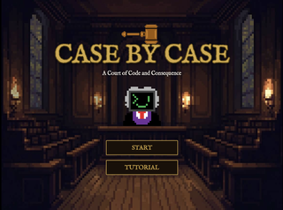

# Game Name

Case By Case

# Team Color

Pink

# Developers

* Tommy Parisi (tparisi@udel.edu)
* Hairum Qureshi (hqureshi@udel.edu)

# Blurb

Case By Case is an educational game that teaches you how to write and evaluate software tests — through the drama of a courtroom. You play as a software attorney whose job is to decide whether a piece of code is guilty of having a bug. Each case gives you a function and a set of unit tests to use as evidence. You pick the tests that best prove your case, declare a verdict, and then the Judge Compiler explains what your choices revealed. It's a fun way to build real instincts for spotting bugs and understanding why good tests matter.

# Basic Instructions

1. Read the function's purpose on the pink tab and its code on the green tab
2. Select up to two test cases as your evidence
3. Submit your verdict: Guilty or Not Guilty
4. Review the Judge Compiler's feedback on each test you selected
5. Aim for full branch coverage — pick tests that explore different logical paths

# Screenshot

# Gameplay Video

# Educational Game Design Document

Link to our [egdd](docs/egdd.md)

# Credits

1. For game menu music: [Pixabay Electronic Game Music](https://pixabay.com/music/electronic-game-game-music-508018/)
2. For the button click sound: [Freesound - AndrewEathan](https://freesound.org/people/AndrewEathan/sounds/538727/)
3. For the game background music: [Freesound - SergeQuadrado](https://freesound.org/people/SergeQuadrado/sounds/683503/)
4. For the click and drag test case sound: [Freesound - Vilkas_Sound](https://freesound.org/people/Vilkas_Sound/sounds/707041/)
5. For the snap draggable test case sound: [Freesound - newagesoup](https://freesound.org/people/newagesoup/sounds/364730/)
6. Judge Compiler sprite art was created by Hairum.
7. Pixel art game assets were created by Tommy and Hairum.
8. Judge Compiler sprites were created using [Sprite Sheet Maker](https://www.finalparsec.com/tools/sprite_sheet_maker)